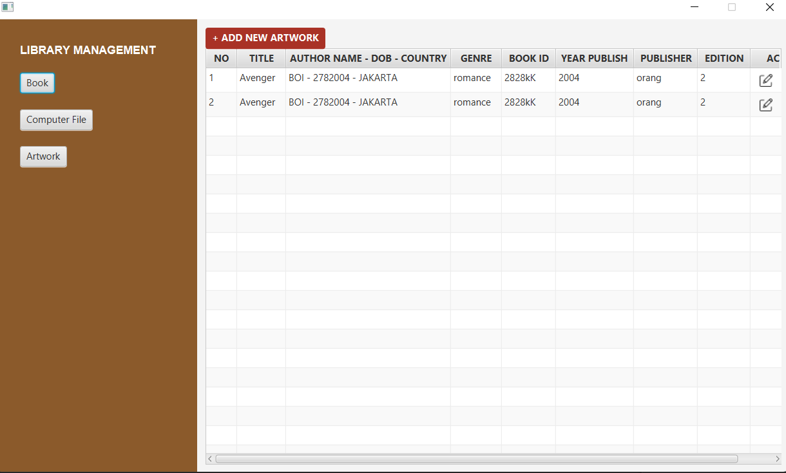

# OOAD-PROJECT-LEC

📚 Library Management System - Desktop App
A simple desktop application for managing a collection of books, artworks, and computer files in a library system. This app is designed with a clean interface and basic CRUD functionalities (Create, Read, Update, Delete) to help users organize and track library content.

🖥️ Features

- Book Management
  Add, edit, and view book details including:

  - Title
  - Author name, date of birth, and country
  - Genre
  - Book ID
  - Year of publication
  - Publisher
  - Edition

- Artwork & Computer File Management
  Future-ready sections to handle artworks and digital/computer files.

- Table View Interface
  Display all added books in a responsive table with clean formatting.

- Edit Functionality
  Edit existing book entries directly from the action column.
